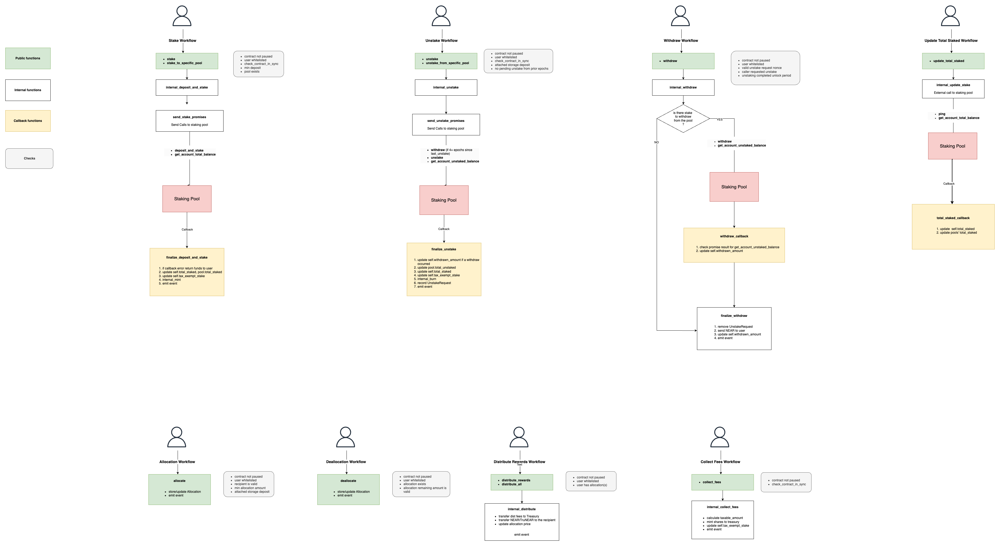

# TruStake on NEAR

The TruFin NEAR staking vault offers users a reliable way of staking NEAR on the NEAR network.
On staking NEAR via the vault, users receive a receipt in the form of the **rewards bearing TruNEAR token**.
In addition to the liquid staking functionality, the TruFin staker supports delegating to different pools as well as the allocation of rewards to different parties.
We briefly present these 2 features as well as share some notes that explain the rationale for some of our decisions.

## Whitelist

Users of our vault must be whitelisted to ensure they have completed offline AML/KYC checks and other onboarding requirements.
The contract will verify if the user is included in our whitelist at the time operations such as staking, unstaking, and others are performed.
The use of a whitelist grants TruFin permission to revoke a whitelist status for a malicious user in order to protect the overall integrity of the protocol.

## Allocations

Each user (then called the *distributor*) can opt to send some or all of the rewards from staking NEAR to another user or wallet address (the *recipient*).  
This additional functionality of allocating staking rewards to a third party can be described by three core functions within our smart contract architecture:

- `allocate` adds an amount of NEAR from a distributor to a recipient at the current share price.
- `deallocate` removes part or the entire amount allocated to a recipient from the distributors allocations list. It reduces the distributor's total allocated amount.
- `distribute_rewards` and `distribute_all` are used to distribute the rewards from an allocation to the corresponding recipients. The distribution can be made in NEAR or TruNEAR and comes out of the distributor's wallet.

**Notes:**
The distributor doesn't need to have funds for rewards available at all times in their wallet. The allocation feature keeps track of allocations made but doesn't enforce distribution or solvency.
Similarly, the distributor can allocate more than their actual balance.

## Multi-delegation pools support

The `near-staker` contract supports the addition of multiple staking pools.
This allows users to choose which pool they want to stake with.  
By design, users are allowed to deposit in any pool and withdraw from any pool.
The price of TruNEAR (aka the share price) is function of the total staked across all pools.

**Notes:**
Pools can be disabled but not deleted.

## Extra security features

### Pausability

The contract is pausable which allows an admin, called the owner, to temporarily prevent anyone from interacting with the contract.  
This is useful in case of an emergency where the contract needs to be stopped while a remediation is pending.

### Lock flag

Methods requiring cross-contract calls use a locking mechanism to prevent re-entrancy attacks and/or common values from being modified out of order. 

### 2-step owner

Replacing the owner is a two-step process, where the new owner account is added as pending and it has to be claimed by the new owner to complete the transfer of ownership.  
This prevents adding an invalid owner, that would render the contract without any owner.

## Note on minimum deposits

We require users to stake a minimum of 1 NEAR every time. 
We also enforce a minimum of 1 NEAR on every allocation.
As we're dealing with institutional clients, we don't expect this to be a problem.  
By design, there is no maximum limit to how much can be deposited by a single user.

## Note on rounding errors

There are situations where rounding errors can lead to bad UX.  
Consider the example of a user who stakes 100 NEAR and then finds out they can only withdraw 99.99999999 NEAR. In such cases, we ensure the user can withdraw the full 100 NEAR by covering the difference ourselves.
As a general practice, we allow for a few yoctoNEAR to account for rounding errors if it improves the user experience.
Due to rounding errors in the staking pools, we calculate and track the total amount of staked assets. 
This means that there might be very small amounts of unstaked assets in the pools that we count as staked.
This is not a security concern as we consider that "draining" our reserve this way would not be worthwhile from an attacker perspective.
To cover costs associated with rounding errors, we ensure the staker account is funded with sufficient NEAR.

## Note on fees

The Treasury is an account controlled by TruFin that receives a specified percentage of all rewards. However, instead of sending these rewards to the Treasury, we mint the equivalent amount of TruNEAR so that the Treasury can also benefit from staking rewards.  
The share price is calculated to already reflect this in order to avoid share price fluctuations when minting TruNEAR for the Treasury.

## Note on unstaking

NEAR staking pools would typically delay the unstaking of assets when new unstaking requests are made. So if a user unstakes some assets at epoch 2 and a new request from another user is made at epoch 4, both users will be able to fully withdraw their assets at epoch 8. This can be delayed even further as unstaking requests come in.
To mitigate this, we allow users to unstake from a pool when there are no pending unstake requests from prior epochs on that pool.

## Note on share price, and updating total staked

Transactions involving staking, unstaking, and fee collection require that the vault's share price accurately reflects the total amount of assets staked across all staking pools. 
To ensure that, we run an off-chain process that calls `update_total_staked` as soon as epochs change.
In the unlikely event that this process has not yet run in the current epoch, users are expected to manually call `update_total_staked` before performing these transactions, otherwise these transactions will fail.

## Note on storage staking

We require users to attach a small amount of NEAR to pay for storage associated with new allocations and unstake operations.
These storage deposits get refunded when users delete their allocations and withdraw their unstaked funds.

# Staker flowchart

This diagram shows the execution flow for different contract calls, and how the contract interacts with staking pools:



# Building

To build the staker contract:

`make clean && make build`  


# Testing

To run unit and integration tests:

`make test`  

# Deploy to testnet

To deploy the Staker contract to testet you can use the `deploy_staker` script:

```
STAKER="your_staker.testnet" \
OWNER_ID="user0.testnet" \
TREASURY="user0.testnet" \
DEFAULT_DELEGATION_POOL="aurora.pool.f863973.m0" \
SECOND_DELEGATION_POOL="pool01b.carlo01.testnet" \
USERS_TO_WHITELIST="user1.testnet,user2.testnet,user3.testnet" \
./scripts/deploy_staker.sh
```

# Upgrade testnet contract

To upgrade the Staker contract in testnet you can use the `upgrade_testnet` script.
Call the script passing the address of the contact and the owner account:

```
./scripts/upgrade_testnet.sh your_staker.testnet user0.testnet
```
